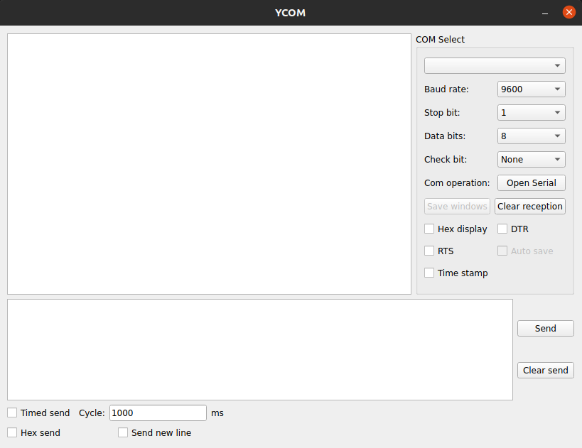

# YCOM

> [中文README](README_zh.md)

## Usage
- Developing using pyqt5
  - **main_ui.ui**: Visual editing files for UI interface, opened using `Qt Designer`.
  - **main_ui.py**: The UI layout file generated by `main_ui. ui` is generated using the command `pyuic5- o main_ui. py main_ui. ui`.
  - **main.py**: Code for the main interface thread.
  - **serial_thread.py**: Code for serial port threads.
- Install
- Uninstall

## TODO
- Waveform display