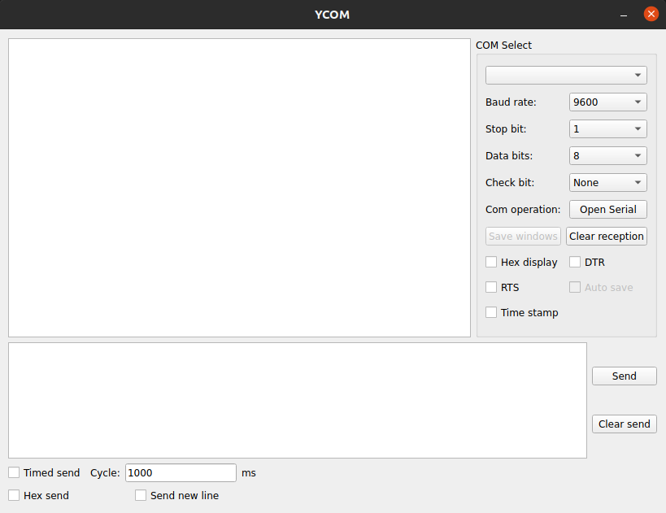

# YCOM

> [English README](README.md)

## 使用说明
- 使用pyqt5开发
  - **main_ui.ui**: ui界面的可视化编辑文件，使用 `Qt Designer` 打开
  - **main_ui.py**: 由 `main_ui.ui` 生成的ui布局文件，使用命令 `pyuic5 -o main_ui.py main_ui.ui` 生成
  - **main.py**: 主界面线程代码
  - **serial_thread.py**: 串口线程代码
- 安装: 
- 卸载:

## 待完成
- 波形图显示